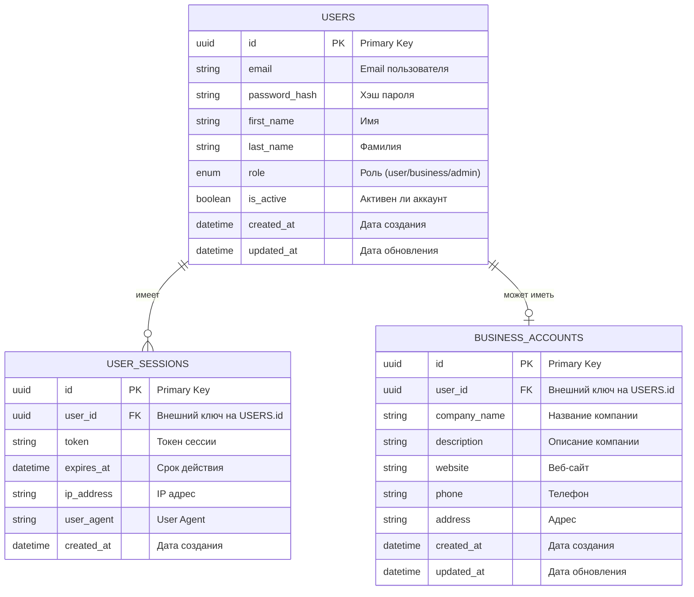
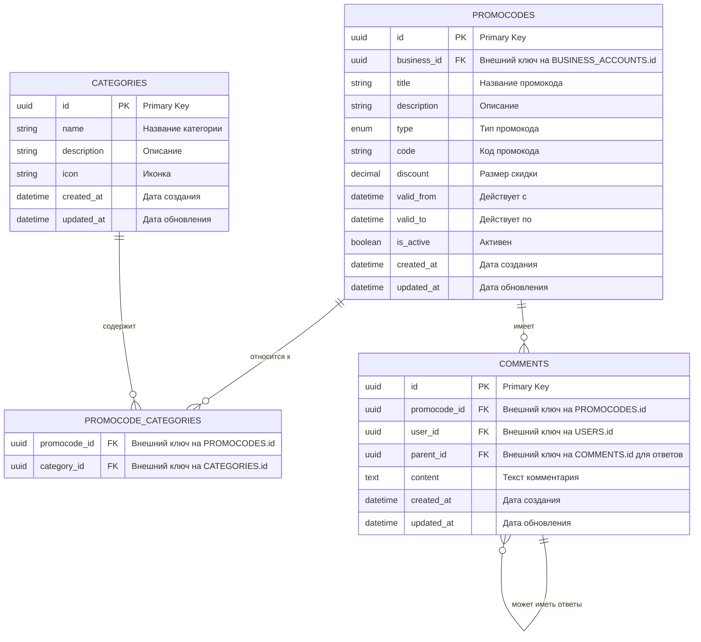
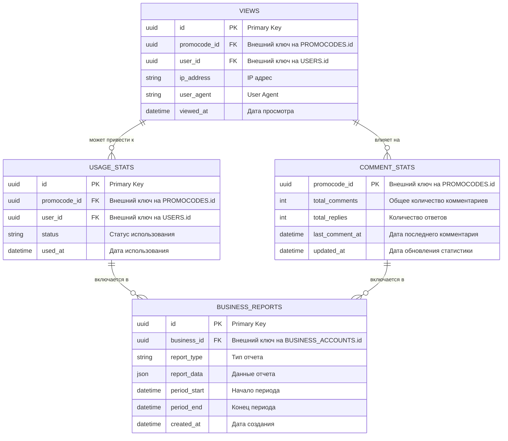

# ER-диаграммы сервисов

## Сервис пользователей

```mermaid
erDiagram
    USERS {
        uuid id PK "Primary Key"
        string email "Email пользователя"
        string password_hash "Хэш пароля"
        string first_name "Имя"
        string last_name "Фамилия"
        enum role "Роль (user/business/admin)"
        boolean is_active "Активен ли аккаунт"
        datetime created_at "Дата создания"
        datetime updated_at "Дата обновления"
    }

    BUSINESS_ACCOUNTS {
        uuid id PK "Primary Key"
        uuid user_id FK "Внешний ключ на USERS.id"
        string company_name "Название компании"
        string description "Описание компании"
        string website "Веб-сайт"
        string phone "Телефон"
        string address "Адрес"
        datetime created_at "Дата создания"
        datetime updated_at "Дата обновления"
    }

    USER_SESSIONS {
        uuid id PK "Primary Key"
        uuid user_id FK "Внешний ключ на USERS.id"
        string token "Токен сессии"
        datetime expires_at "Срок действия"
        string ip_address "IP адрес"
        string user_agent "User Agent"
        datetime created_at "Дата создания"
    }

    USERS ||--o{ USER_SESSIONS : "имеет"
    USERS ||--o| BUSINESS_ACCOUNTS : "может иметь"
```

## Сервис промокодов

```mermaid
erDiagram
    PROMOCODES {
        uuid id PK "Primary Key"
        uuid business_id FK "Внешний ключ на BUSINESS_ACCOUNTS.id"
        string title "Название промокода"
        string description "Описание"
        enum type "Тип промокода"
        string code "Код промокода"
        decimal discount "Размер скидки"
        datetime valid_from "Действует с"
        datetime valid_to "Действует по"
        boolean is_active "Активен"
        datetime created_at "Дата создания"
        datetime updated_at "Дата обновления"
    }

    CATEGORIES {
        uuid id PK "Primary Key"
        string name "Название категории"
        string description "Описание"
        string icon "Иконка"
        datetime created_at "Дата создания"
        datetime updated_at "Дата обновления"
    }

    PROMOCODE_CATEGORIES {
        uuid promocode_id FK "Внешний ключ на PROMOCODES.id"
        uuid category_id FK "Внешний ключ на CATEGORIES.id"
    }

    COMMENTS {
        uuid id PK "Primary Key"
        uuid promocode_id FK "Внешний ключ на PROMOCODES.id"
        uuid user_id FK "Внешний ключ на USERS.id"
        uuid parent_id FK "Внешний ключ на COMMENTS.id для ответов"
        text content "Текст комментария"
        datetime created_at "Дата создания"
        datetime updated_at "Дата обновления"
    }

    PROMOCODES ||--o{ PROMOCODE_CATEGORIES : "относится к"
    CATEGORIES ||--o{ PROMOCODE_CATEGORIES : "содержит"
    PROMOCODES ||--o{ COMMENTS : "имеет"
    COMMENTS ||--o{ COMMENTS : "может иметь ответы"
```

## Сервис статистики

```mermaid
erDiagram
    VIEWS {
        uuid id PK "Primary Key"
        uuid promocode_id FK "Внешний ключ на PROMOCODES.id"
        uuid user_id FK "Внешний ключ на USERS.id"
        string ip_address "IP адрес"
        string user_agent "User Agent"
        datetime viewed_at "Дата просмотра"
    }

    USAGE_STATS {
        uuid id PK "Primary Key"
        uuid promocode_id FK "Внешний ключ на PROMOCODES.id"
        uuid user_id FK "Внешний ключ на USERS.id"
        string status "Статус использования"
        datetime used_at "Дата использования"
    }

    COMMENT_STATS {
        uuid promocode_id PK "Внешний ключ на PROMOCODES.id"
        int total_comments "Общее количество комментариев"
        int total_replies "Количество ответов"
        datetime last_comment_at "Дата последнего комментария"
        datetime updated_at "Дата обновления статистики"
    }

    BUSINESS_REPORTS {
        uuid id PK "Primary Key"
        uuid business_id FK "Внешний ключ на BUSINESS_ACCOUNTS.id"
        string report_type "Тип отчета"
        json report_data "Данные отчета"
        datetime period_start "Начало периода"
        datetime period_end "Конец периода"
        datetime created_at "Дата создания"
    }

    VIEWS ||--o{ USAGE_STATS : "может привести к"
    VIEWS ||--o{ COMMENT_STATS : "влияет на"
    USAGE_STATS ||--o{ BUSINESS_REPORTS : "включается в"
    COMMENT_STATS ||--o{ BUSINESS_REPORTS : "включается в"
``` 